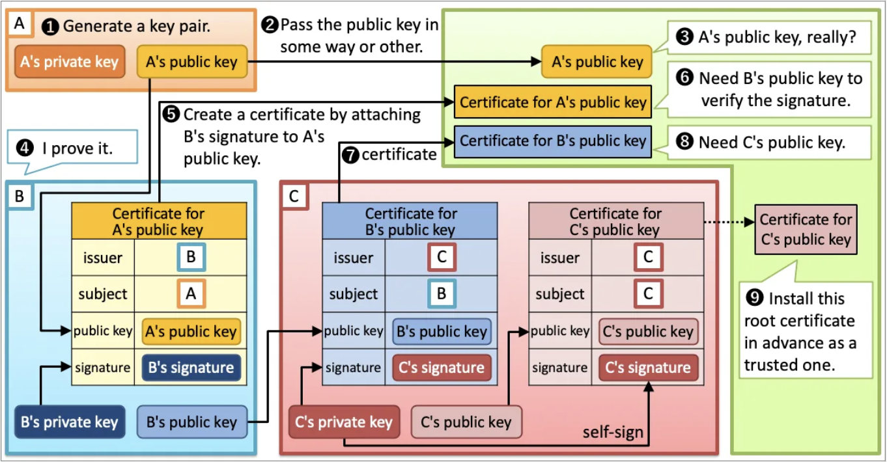
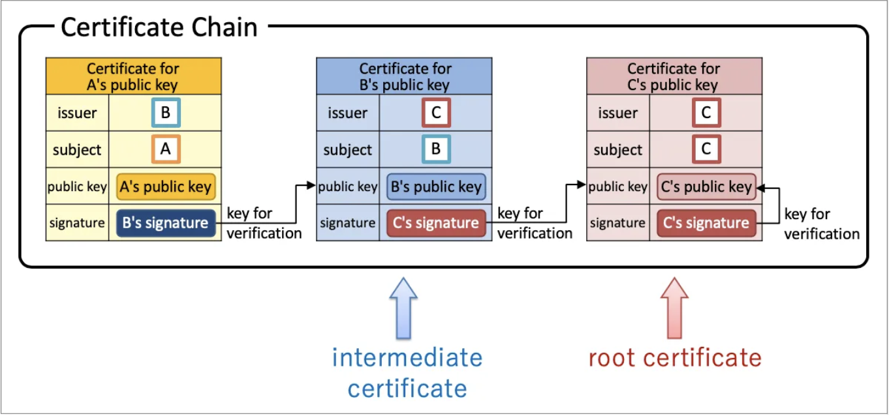
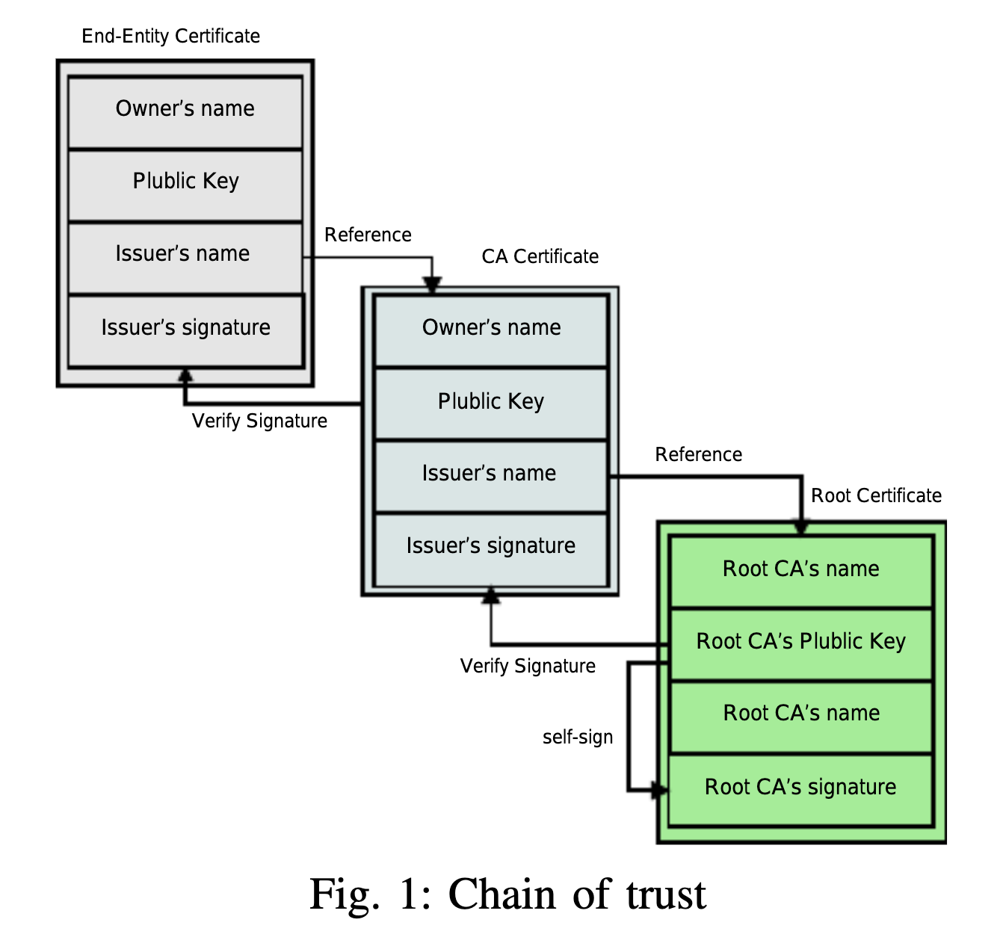

# Certificate Issuer [SGP.22 - RSP Technical Specification v2.6](https://www.gsma.com/solutions-and-impact/technologies/esim/wp-content/uploads/2024/09/SGP.22-v2.6.pdf)

A Certificate Issuer issues certificates for Remote SIM Provisioning system entities and acts as a trusted root for the purpose of authentication of the entities of the system. The specification supports X.509 certificate format.  

The following certificates SHALL be signed and issued by a GSMA CI:
- GSMA CI Certificate (CERT.CI.ECDSA)
- EUM Certificates (CERT.EUM.ECDSA)
- SM-DP+ Certificate (CERT.DPauth.ECDSA and CERT.DPpb.ECDSA)
- SM-DP+ TLS Certificate (CERT.DP.TLS)
- SM-DS Certificate (CERT.DSauth.ECDSA)
- SM-DS TLS Certificate (CERT.DS.TLS)

The following certificate SHALL be signed and issued by the EUM:
- eUICC Certificate (CERT.EUICC.ECDSA)

Even though each eUICC SHALL support at least two sets of elliptic curve parameters, which can be chosen from by an RSP server for its signatures and ECKA, an eUICC SHALL have at least one CERT.EUICC.ECDSA.

The Algorithm Identifiers of all certificates of a certificate chain SHALL point to the same curve.
- The SM-DP+ has 2 ECDSA Certificates (CERT.DPauth.ECDSA and CERT.DPpb.ECDSA).
- The CERT.DPauth.ECDSA is used for authentication to the eUICC, and the CERT.DPpb.ECDSA is used for Profile binding.
- The certificates CERT.CI.ECDSA, CERT.EUICC.ECDSA, CERT.EUM.ECDSA, CERT.DPauth.ECDSA, CERT.DPpb.ECDSA, CERT.DP.TLS, CERT.DSauth.ECDSA, and CERT.DS.TLS exchanged over ES9+, ES10b, ES8+ and ES11 are described in the next sections.

# X.509 certificates and Chain of Trust

## ASN.1

- Standard Interface Description Language (IDL) for defining data structures that can be serialized and deserialized in a cross-platform way.

- Used to define a large number of protocols. 

- Most extensive uses: telecommunications, cryptography, and biometrics.

- X.509 certificate is one of the standards defined in the ASN.1 module under the X.500 directory services.

## [X.509 Certificates](https://darutk.medium.com/illustrated-x-509-certificate-84aece2c5c2e)

- Mostly used in TLS (Transport Layer Security)

- Allows all parties to access the details of a user’s X.509 certificate. Even normal users on a web browser can do so by clicking the padlock next to a page’s URL in the address bar.

- 3 types of certificates: Root certificate, Intermediate certificate, and End-entity certificate.

Root certificate: 

- Primary certificate of trust, used by CA to sign all certificates

- Must be the final certificate in the trust store

Intermediate certificate:

- X.509 certificate that the root CA signs

- Certificate used by certificate providers so they can issue certificates

End-entity certificate:

- X.509 certificates that assure the identity of a party, such as a website.

- Also known as leaf certificates, as nothing further can be grown from them

## [Chain of Trust](https://www.researchgate.net/publication/323692746_A_Blockchain-Based_PKI_Management_Framework)

- The system first examines the end-entity’s certificate.

- It then checks if the end-entity’s certificate was issued by a trusted Intermediate CA and then checks for the intermediate certificate’s signature.

- Then it checks if the intermediate CA’s certificate was issued and signed by the trusted Root CA.

- If every certificate in the chain can be validated by the certificate above it, all the way up to a trusted root CA, then the entire chain is trusted.

- If any certificate in the chain is untrusted or has been tampered with, the chain is broken, and the end entity certificate is considered untrusted.

## Disadvantages:

- If one of the certificates in the chain is revoked, then all of the chain becomes invalid.

- Single Point of Failure

- Certificates exchange EID of the user, which is the most sensitive and private data related to an eSIM

- Moreover, the EID doesn’t follow a strict data type, it varies with conditions.

- Verification of a certificate needs to be a step by step flow, first checking the end-entity certificate and then the validity of the issuing authority (all the intermediate CAs that were part of this chain) and the Root CA.
