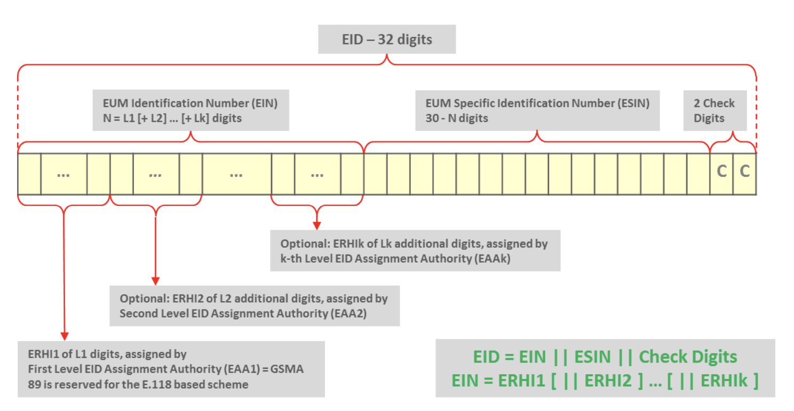
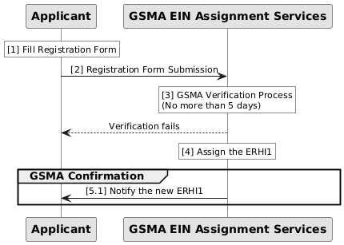

# EID Definition and Assignment Process

## Introduction to EID

The eUICC Identifier (EID) is an unique global serial number for eUICCs. The EID is not related to services and subscriptions. Initially the format for EID was inherited from the Integrated Circuit Card Identifier (ICCID) format where certain fields of the ICCID were embedded in the EID structure.

The ICCID is defined by [ITU-T E.118](https://www.itu.int/rec/T-REC-E.118-200605-I/en) as a Primary Account Number (PAN) and within ICCID there is an Issuer Identifier Number (IIN). However, the EID is not a PAN, as it is not meant for charging services. National authorities issue IINs/ICCIDs under various rules, leading to challenges for manufacturers, including difficulties in obtaining EIDs in certain cases.

## eUICC Numbering System

The length of EID is fixed at 32 digits. The composition for a compliant EID is given below

  
EID Structure

Breaking down each component of EID Structure

- The EUM Identity Number (EIN) → N digits (variable length)
    - The EIN is composed of one or more concatenated EID Range Holder Identifiers (ERHIx), with the final ERHI assigned to an EUM
    - Each ERHI is allocated by an EIN Assignment Authority (EAA) to either an EUM or another EAA
    - The EAA ensures that the ERHIs it assigns are unique
    - ERHIs that are assigned do not need to have a uniform length
    - The EAA decides how many digits the assigned ERHIs will contain. For example, if ERHI 11 is assigned to entity A, ERHIs 110 to 119 or any other number starting with 11 can no longer be assigned, but ERHIs 120 to 129 can be allocated to entities B through K
    - The GSMA acts as first level EAA
    - GSMA will assign ERHI1s to
        - EUMs
        - National Authorities
        - Device Manufacturers
        - Group of Device Manufacturers
    - Examples on chain of ERHIs:
        - The GSMA assigns ERHI1 to an EAA, the EAA assigns ERHI2 values to Device Manufacturers (identified by their GSMA-assigned ERHI1 value), and the Device Manufacturer assigns ERHI3 to an EUM (identified by the EAA-assigned ERHI2 value).
        - The GSMA assigns ERHI1 to a Device Manufacturer, and the Device Manufacturer assigns ERHI2 values to an EUM (identified by its GSMA-assigned ERHI1 value).
        - The GSMA assigns ERHI1 to a Group of Device Manufacturers, the Group assigns ERHI2 values to a single Device Manufacturer (identified by its GSMA-assigned ERHI1 value), and the single Device Manufacturer assigns ERHI3 to an EUM (identified by its EAA-assigned ERHI2 value).
- The EUM Specific Identification Number (ESIN) → 30 - N digits (variable length, depends on EIN)
    - ESINs are assigned by EUM
    - EUM assures that assigned ESINs are unique
- The Check digits → 2 check digits calculated by EUM over all 32 digits
    - Set initial value of check digits as zero
    - Using the resulting 32 digit EID (decimal integer), compute modulo 97
    - Subtract the resulting modulo value from 98 and use the resulting value as heck digits (if result is only one digit then pad it by prefixing 0 as first check digit)

> **EIDs can be verified using it as a 32 digit decimal integer and performing modulo 97 for it. If the result is 1 then the EID is valid, otherwise the verification fails.**

## Criteria for ERHI1 Assignment

The following criteria has to be met by an entity to get an ERHI1 assigned to it

- The applicant applying for an ERHI1 SHALL NOT already have an ERHI1 assigned
to it, except in the justified exceptions
- The applicant SHALL commit to use ERHI1 (within 12 months of release date)
- For Non-National Authorities
    - The applying entity SHALL be an EUM or (Group of) Device Manufacturers
    AND
    - Applicant SHALL be a single corporate entity operating under a specific legislative regulation.

### ERHI1 Assignment Process

  
ERHI Level 1 Assignment

The Process is defined by GSMA as follows:

1. Form Filling
2. Submission
Completed registration forms are sent to [EISRegistration@gsma.com](mailto:EISRegistration@gsma.com)
3. Verification
GSMA verifies the authenticity of applicant company and the validity of application
4. Assignment/Rejection
On the basis of Verification result in Step 3, GSMA assigns the ERHI1
5. GSMA Confirmation

### ERHI1 Cancellation Process

  
ERHI1 Cancellation

In addition to the EIN Assignment Process, an ERHI1 that is no longer used by a company
may be cancelled by the EIN Assignment Authority. The process for this as defined by GSMA is

1. Form Filling
2. Submission
Completed cancellation forms are sent to [EISRegistration@gsma.com](mailto:EISRegistration@gsma.com)
3. Verification Process
4. GSMA Confirmation

## References

- [Abbreviations](./References/Abbreviations.md)
- [Definitions](./References/Definitions.md)
- [EID Principles](./References/Principles.md)
- [EID Requirements](./References/Requirements.md)
- [ITU-T E.118](https://www.itu.int/rec/T-REC-E.118-200605-I/en)
- [ISO/IEC 7812-1](https://www.iso.org/standard/70484.html)
- [GSMA SGP.29 - EID Definition](https://www.gsma.com/solutions-and-impact/technologies/esim/wp-content/uploads/2024/03/SGP.29-v1.1.pdf)
